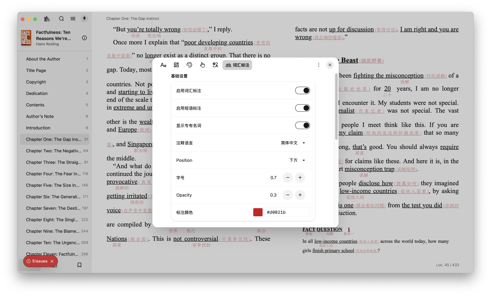
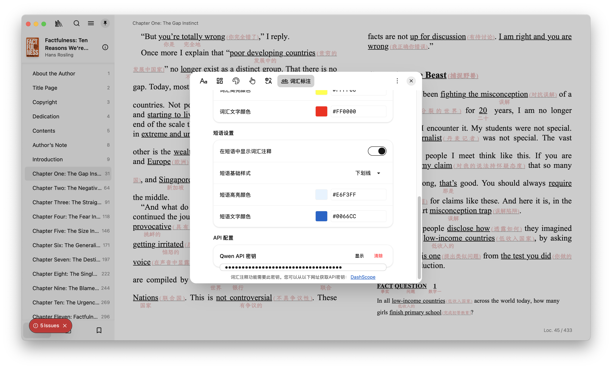
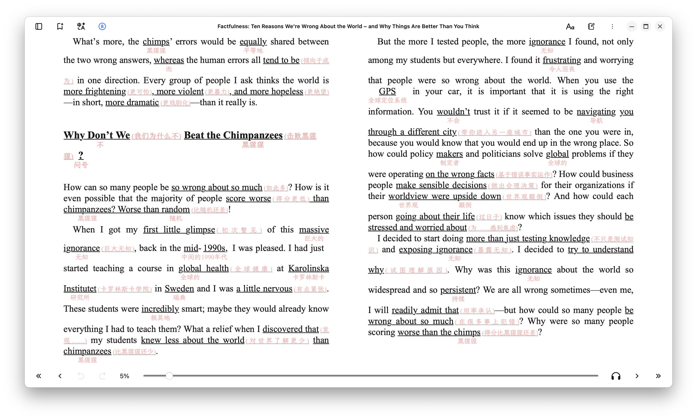

    中文&nbsp ｜ &nbsp<a href="README.md">English</a>

  
  <h1>ReadFlow 📚</h1>
  <h3>基于 LLM 的智能注释阅读器</h3>
   

✨ **ReadFlow** 基于优秀的开源项目 [Readest](https://github.com/readest/readest) 开发，专注于通过 **LLM 智能注释**帮助读者理解英文书籍中的生词、词组和专有名词。

  
🔥 **核心特性** 🔥

| 🎯 **智能注释** | 🌐 **多语言支持** | ⚡ **实时处理** |
|:---:|:---:|:---:|
| LLM驱动的词汇/词组/专有名词注释 | 目前支持中文注释英文，更多语言即将支持 | 基于段落的并发处理，避免阻塞 |

## 🚀 核心功能

  
  

    
     
    <strong>📝 智能注释设置</strong>
  

  

    
     
    <strong>⚙️ 高级配置选项</strong>
  

  

    
     
    <strong>✨ 注释效果实况</strong>
  

### 🎯 LLM 智能注释

- ✅ **词汇注释**：自动识别并注释生词，提供准确的中文释义
- ✅ **词组识别**：智能识别英语词组和搭配，完全由LLM决策
- ✅ **专有名词**：准确注释人名、地名、机构名等专有名词
- ✅ **中译英支持**：目前完美支持中文注释英文书籍
- 🔄 **策略优化**：未来将通过prompt engineering提供多种注释策略
- 🔄 **多语言扩展**：正在适配更多语言对的注释支持

### 📚 阅读体验

| **功能** | **描述** |
|:---|:---|
| **多格式支持** | EPUB, MOBI, KF8 (AZW3), FB2, CBZ, TXT, PDF |
| **智能高亮** | 自动高亮注释词汇，支持自定义样式 |
| **个人词库** | 记录学习进度，未来将大幅优化 |
| **快速注释** | 段落并发处理，注释速度持续优化中 |

### 🔮 发展规划

| **计划** | **状态** | **说明** |
|:---|:---:|:---|
| **多语言注释** | 🔄 开发中 | 扩展到更多语言对的注释支持 |
| **注释策略** | 🔄 设计中 | 通过prompt engineering提供多种注释策略 |
| **个人词库优化** | 📋 计划中 | 全面优化个人学习词库功能 |
| **注释速度优化** | 🔄 持续中 | 不断优化LLM推理和注释展示速度 |
| **移除翻译功能** | ⚠️ 待定 | 专注注释功能，移除全文翻译（避免与原作者付费功能冲突） |

---

## 📱 关注我们

### 持续更新，敬请关注！

<table>
<tr>
<td align="center">
<strong>🔴 小红书</strong>
 
<code>486389016</code>
</td>
<td align="center">
<strong>🎵 抖音</strong>
 
<code>21429984344</code>
</td>
</tr>
</table>

📺 **关注获取最新功能更新、使用技巧和开发进度**

---

## ⚖️ 开源协议

ReadFlow 基于 [GNU Affero General Public License v3.0](LICENSE) 开源协议发布。

### 致谢

特别感谢 [Readest](https://github.com/readest/readest) 项目为我们提供了优秀的基础框架。

---

✨ **用 ReadFlow 开启智能阅读新体验** ✨

